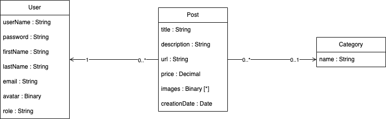

# Model Documentation

## Conceptual Design

## Logic Design (Relational Model)

User(**id**, userName, password, firstName, lastName, email, avatar, role)

Category(**id**, name)

Post(**id**, title, description, url, price, creationDate, positiveRatings, negativeRatings, expired, userId, 
categoryId)
+ **userId** references User(id) ON UPDATE CASCADE ON DELETE CASCADE 
+ **categoryId** references Category(id) ON UPDATE CASCADE ON DELETE SET 
NULL

> **_NOTE:_**  For inheritance management, we chose the TABLE PER CLASS strategy (although it is not the most efficient option for this second iteration) as a long-term option due to its better handling of requirements evolution and future product maintenance as this project is in a continuous changing environment.

Offer(**id**)
+ **id** references Post(id) ON UPDATE CASCADE ON DELETE CASCADE

Coupon(**id**, code)
+ **id** references Post(id) ON UPDATE CASCADE ON DELETE CASCADE

Image(**id**, data, postId)
+ **postId** references Post(id) ON UPDATE CASCADE ON DELETE CASCADE

Rating(**id**, positive, userId, postId)
+ **userId** references User(id) ON UPDATE CASCADE ON DELETE CASCADE 
+ **postId** references Post(id) ON UPDATE CASCADE ON DELETE CASCADE