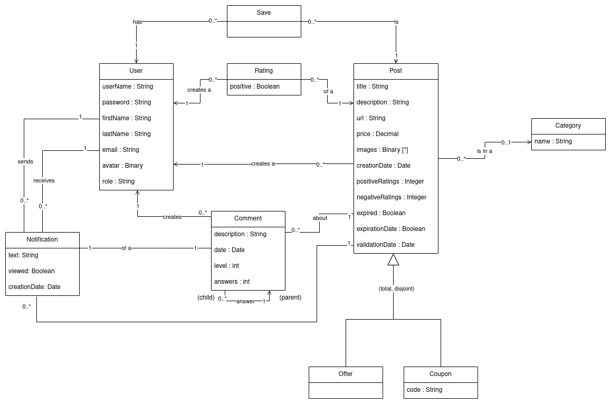

# Model Documentation

## Conceptual Design

## Logic Design (Relational Model)

User(**id**, userName, password, firstName, lastName, email, avatar, role)

Category(**id**, name)

Post(**id**, title, description, url, price, creationDate, userId, 
categoryId)
+ **userId** references User(id) ON UPDATE CASCADE ON DELETE CASCADE 
+ **categoryId** references Category(id) ON UPDATE CASCADE ON DELETE SET 
NULL

Image(**id**, data, postId)
+ **postId** references Post(id) ON UPDATE CASCADE ON DELETE CASCADE

